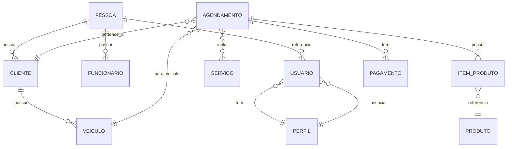

# Sistema de Agendamento de Oficina Automotiva

Projeto desenvolvido para gerenciar o agendamento de serviços automotivos (revisão, troca de óleo, alinhamento, etc.) permitindo que clientes possam agendar serviços de interesse, acompanhando horários disponíveis e status do atendimento. O sistema também vai permitir gerenciamento por parte da oficina, como controle de agenda, serviços oferecidos e clientes cadastrados.


## Stack Tecnológica

- **Linguagem:** Java
- **Framework Principal:** Spring Boot
- **Persistência:** Spring Data JPA
- **Segurança:** Spring Security + JWT (autenticação e autorização))
- **Bancos de Dados:** PostgreSQL, em `dev` usamos H2 em memória
- **Documentação:** Swagger / OpenAPI
- **Frontend:** React (Vite)
- **Controle de Versão:** GitHub

## Requisitos Funcionais

- **RF01: Cadastro de Usuários** - Registro de novos usuários (clientes e funcionários).
- **RF02: Autenticação e Login** - Sistema de login seguro com JWT.
- **RF03: Controle de Perfis de Acesso** - Gestão dos usuários com perfil Cliente, Gerente e Mecânicos.
- **RF04: Gerenciamento de Clientes** - Manutenção dos dados dos clientes pela oficina.
- **RF05: Gerenciamento de Veículos** - Vínculo de veículos aos clientes.
- **RF06: Gerenciamento do Catálogo de Serviços** - Gestão do catálogo de serviços oferecidos.
- **RF07: Criação de Agendamentos** - Registro de novas solicitações de serviço.
- **RF08: Listagem de Horários Disponíveis** - Consulta de disponibilidade de agenda.
- **RF09: Alteração e Cancelamento de Agendamentos** - Gestão do ciclo de vida do agendamento.
- **RF10: Controle de Status dos Serviços** - Acompanhamento do progresso do serviço (ex: Em execução, Finalizado).
- **RF11: Consultas Personalizadas por Período** - Filtros de serviços por período e status.
- **RF12: Consultas por Cliente/Veículo** - Filtros para localização de clientes e veículos.

## Equipe e Divisão de Tarefas

- **Marlus Silva (marlus@imd.ufrn.br):** Modelagem, requisitos, configuração de banco, regras de negócio e endpoints REST, segurança e queries.
- **Bruno Silva (brunosfs@gmail.com):** Frontend/API, CRUDs auxiliares, configuração de banco, documentação e testes de endpoints.
- **Glauber Galvão (glauber.galvao@gmail.com):** Modelagem, implementação de entidades e cadastros, suporte em testes.

## Modelo de Dados (Diagrama de Relacionamentos)

Diagrama ER (entidades em `Agendamente-Servicos-carro/src/main/java/.../model`):



As classes de domínio estão em `Agendamente-Servicos-carro/src/main/java/br/ufrn/imd/agendamenteservicoscarro/model`.

## Ambientes de execução

- Desenvolvimento (local):
	- Perfil `dev` usa H2 em memória. Config: `Agendamente-Servicos-carro/src/main/resources/application-dev.properties`.
	- Popula dados de desenvolvimento com `data-dev.sql`.
	- Rodar backend em dev:
		```bash
		cd Agendamente-Servicos-carro
		./mvnw spring-boot:run -Dspring-boot.run.profiles=dev
		```
	- H2 console: `http://localhost:8080/h2-console` (quando `dev` ativo). Ver `H2ConsoleConfig.java`.

- Produção / integração com bancos externos:
	- `application-prod.properties` aponta para PostgreSQL.
    - Popula dados em produção com `data.sql`.
    - Rodar backend em prod:
		```bash
		cd Agendamente-Servicos-carro
		./mvnw spring-boot:run -Dspring-boot.run.profiles=prod
		```
    - Acessar backend em `http://localhost:8080/`.
    - Parâmetros sensíveis em arquivo `.env` (compatível com ambiente de produção).
    

- Docker / compose:
	- No `docker-compose.yml` se define o build do backend.
	- Exemplo:
		```bash
		docker compose up --build
		```

## Arquivos de configuração importantes

- `Agendamente-Servicos-carro/src/main/resources/application-prod.properties` — conexões Postgres, JWT.
- `Agendamente-Servicos-carro/src/main/resources/application-dev.properties` — perfil `dev` (H2, seed).
- `Agendamente-Servicos-carro/src/main/java/.../config/JpaConfig.java` — JPA/Hibernate.
- `Agendamente-Servicos-carro/src/main/java/.../config/H2ConsoleConfig.java` — console H2.

## Frontend — estrutura e como rodar

O frontend está em `frontend-oficina` (Vite + React). Principais pontos:

- `frontend-oficina/src/main.jsx` — entrada da app.
- `frontend-oficina/src/App.jsx` — componente raiz.
- `frontend-oficina/src/pages/` — páginas (Home, Login, Agendar, MeusAgendamentos, Clientes, Produtos, Serviços, Usuários, Veículos).
- `frontend-oficina/src/components/` — componentes reutilizáveis (Navbar, Footer, StatusBadge).
- `frontend-oficina/src/context/AuthContext.jsx` — gerenciamento de autenticação e token.
- `frontend-oficina/src/services/api.js` — cliente `axios` configurado para backend.

Como executar localmente:

```bash
cd frontend-oficina
npm install
npm run dev
```

Vite normalmente serve em `http://localhost:5173/` (ou porta alternativa se 5173 estiver ocupada).

## Dados de teste / usuários de seed

Os scripts de seed estão em `Agendamente-Servicos-carro/src/main/resources/data-dev.sql` (H2 dev) e `data.sql` (Postgres). Usuários de teste:

- `admin@oficina.com` / `senha123` — `ROLE_GERENTE`
- `joao@email.com` / `senha123` — `ROLE_CLIENTE`
- `pedro.mec@oficina.com` / `senha123` — `ROLE_MECANICO`


